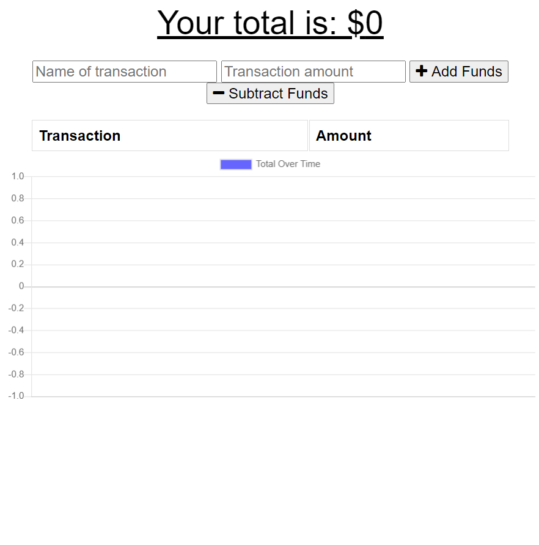
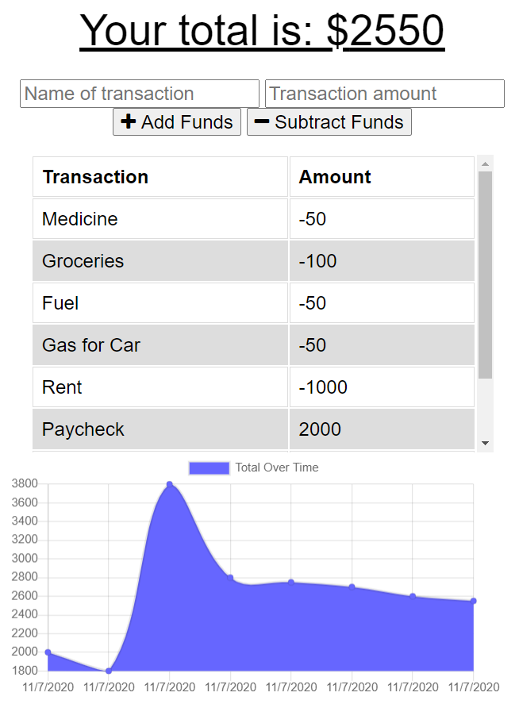
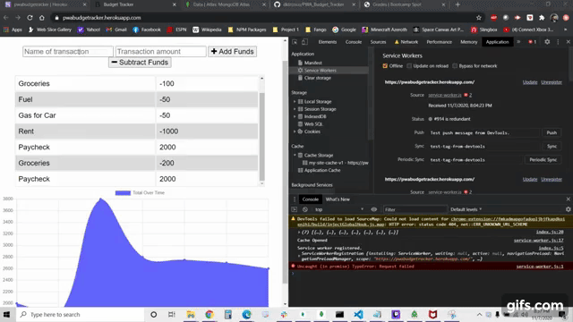

# PWA_Budget_Tracker

Link to Heroku Deployment: https://pwabudgetracker.herokuapp.com/

Table of Contents
* [User Story](#story)
* [Images](#images)
* [Gifs](#gifs)
* [Install](#install)
* [Contribution](#contribution)
* [Testing](#testing)
* [Questions](#questions)

## Story

AS AN avid traveller I WANT to be able to track my withdrawals and deposits with or without a data/internet connection SO THAT my account balance is accurate when I am traveling.

GIVEN a user is using this Heroku-deployed Budget App

WHEN there is no internet connection

THEN any user input (withdrawal or deposit) will be displayed and added to their transaction history when their connection is back on

## Images

Fig. 1: Landing Page Before Data

Fig. 2: Budget Data Displayed

## Gifs

Gif 1: Offline Functionality

## Install

Being a Heroku-deployed application, there is no installation required for the user.

Being open-source, if someone wants to dig into the nuts and bolts of this application, simply clone the repo and use the CLI to install the necessary node module packages/dependencies

It should be noted that this application utilizes MongoDB locally (MongoDB Atlas for Heroku Deployment Use), so this should be installed separately prior to running/testing this application locally.

## Contribution

Pull requests are welcome. For major changes, please open an issue first to discuss what you would like to change.

Please make sure to update tests as appropriate.

Please contact me (chris.kabana@gmail.com) if you have something specific you would like to discuss.

## Testing

If you are investigating this code locally, testing through cli and local hosting is encouraged. If you find anything, please open an issue or contact me directly.

## Questions

If you have any questions that are not answered, please feel free to reach out to me at my email (chris.kabana@gmail.com)

You can also reach out to me on GitHub by searching for my username: dktrcoco

Or following the link: https://github.com/dktrcoco